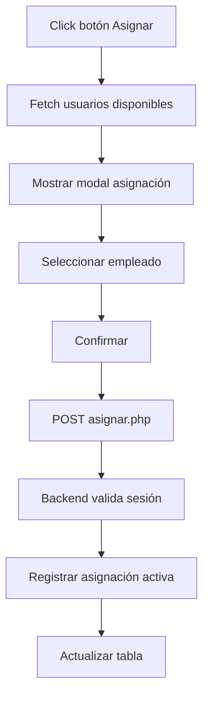

```mermaid
flowchart TD

A[Click botón Asignar] --> B[Fetch usuarios disponibles]
B --> C[Mostrar modal asignación]

C --> D[Seleccionar empleado]
D --> E[Confirmar]

E --> F[POST asignar.php]
F --> G[Backend valida sesión]
G --> H[Registrar asignación activa]
H --> I[Actualizar tabla]
```