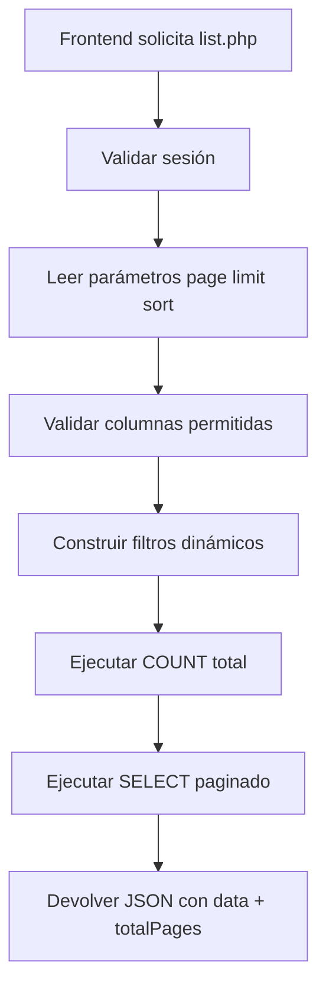

```mermaid
flowchart TD

A[Frontend solicita list.php] --> B[Validar sesión]

B --> C[Leer parámetros page limit sort]
C --> D[Validar columnas permitidas]
D --> E[Construir filtros dinámicos]

E --> F[Ejecutar COUNT total]
F --> G[Ejecutar SELECT paginado]
G --> H[Devolver JSON con data + totalPages]
```