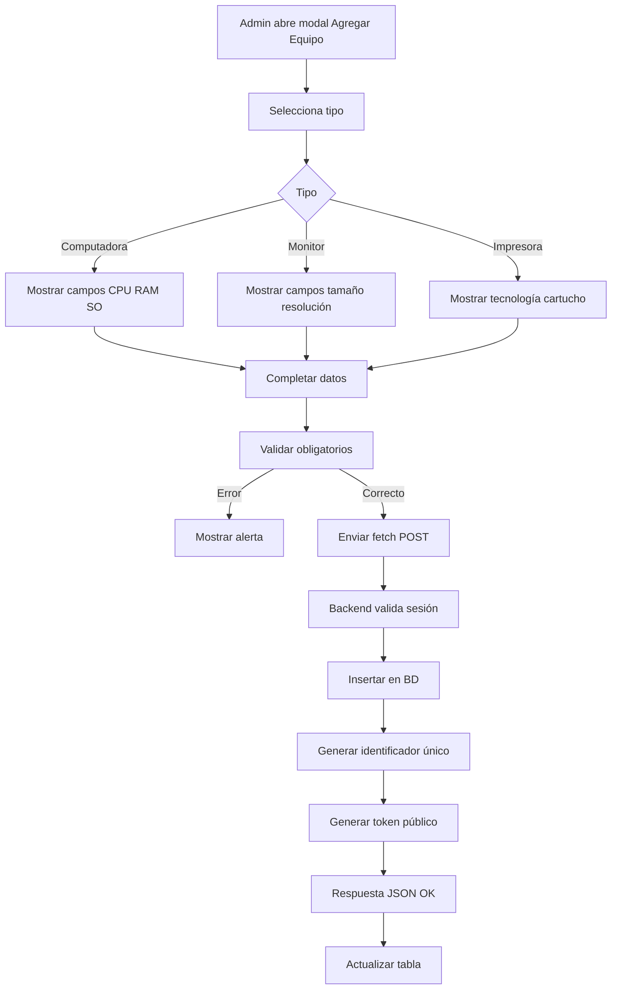

```mermaid
flowchart TD

A[Admin abre modal Agregar Equipo] --> B[Selecciona tipo]

B --> C{Tipo}

C -->|Computadora| D[Mostrar campos CPU RAM SO]
C -->|Monitor| E[Mostrar campos tamaño resolución]
C -->|Impresora| F[Mostrar tecnología cartucho]

D --> G[Completar datos]
E --> G
F --> G

G --> H[Validar obligatorios]
H -->|Error| I[Mostrar alerta]
H -->|Correcto| J[Enviar fetch POST]

J --> K[Backend valida sesión]
K --> L[Insertar en BD]
L --> M[Generar identificador único]
M --> N[Generar token público]
N --> O[Respuesta JSON OK]
O --> P[Actualizar tabla]
```